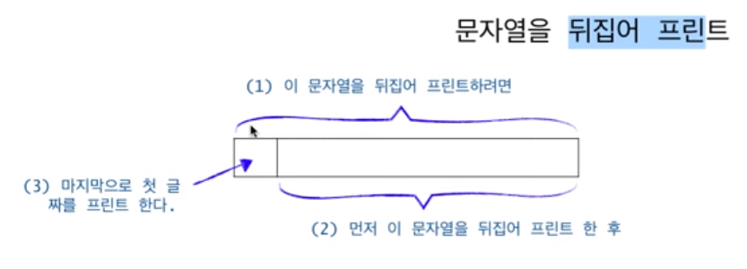

## Recursion

- 재귀적으로 문제를 바라보는 방식

  

  ~~~c
    // (1) 길이가 len 인 string 을 뒤집어 출력하고자 하면
    void print_string(char[] string, int len){
       if(len == 0)  return;
       
		// (2) string[1..] 을 뒤집어 출력하고 나서 
		print_string(string, len-1);

       // (3) string[0] 을 출력하면 된다
		printf("%c", string[len]);
	}
  ~~~
