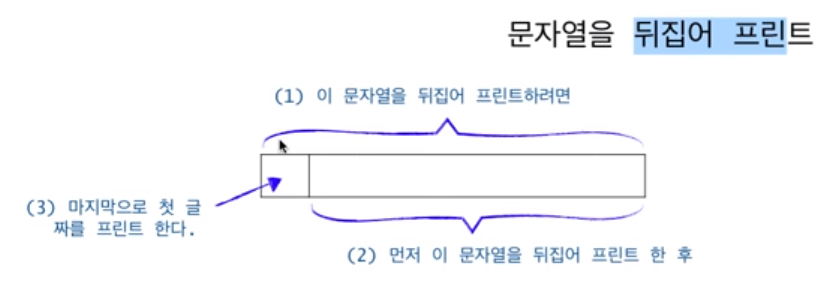

## Recursion

#### 재귀적으로 문제를 바라보는 방식

   **1. 문자열 뒤집어서 출력하는 사례**

  

  ~~~c
    // (1) 길이가 len 인 string 을 뒤집어 출력하고자 하면
    void print_string(char[] string, int len){
       if(len == 0)  return;
       
		// (2) string[1..] 을 뒤집어 출력하고 나서 
		print_string(string, len-1);

       // (3) string[0] 을 출력하면 된다
		printf("%c", string[len]);
	}
  ~~~

   **10진수를 2진수로 변환하여 출력하는 사례**
  
  - 입력이 0 보다 큰 경우
    - 2로 나눈 몫에 대해 2진수를 구한다
    - 2로 나눈 나머지에 해당하는 비트인 나머지를 출력한다
  - 그렇지 않은 경우 종료한다
  
  `즉, 2로 나누어 몫과 나머지를 분리하고 몫은 재귀적인 루프를 만들고 나머지는 단계적인 산출로 정의한다.`
  `단계적 산출물의 출력은 재귀적 루프 전/후 어디에 둘 것인가를 결정해야한다` 
  ~~~c
  void convert_bin ( int num ) {
	if (num == 0) return;

	int remain = num % 2, quantity = num / 2;

	convert_bin ( quantity );

	printf ( "%d" , remain );
  }
  ~~~

  **2. 재귀 구조에서의 반환 루틴**

  **배열의 합을 구하여 반환하는 사례**

   - 잘못된 사고 방식 (매번 틀림)
   - `반환되는 sum 지역 변수가 반환 루틴에서 이어지지 않는 문제임`    

   ~~~c
	int sum_array ( int arr[] , int idx, int arr_len, int sum) {
		if (idx == arr_len)	return sum;

		sum += arr[idx++];

		sum_array ( arr , idx , arr_len , sum );

		return sum;
	}
   ~~~
    
   - 위와 같은 코드는 아래의 흐름으로 동작함
      `즉, 최초 생성되는 지역 변수의 값으로 외부로 전달되어 함수 호출로 만들어지는 합의 값이 제대로 전달되지 않음`
      

   - 아래와 같은 생각을 해야 함
    
   ~~~c
	int sum_array ( int arr[] , int idx, int arr_len, int sum) {
		if (idx == arr_len)	return sum;

		sum += arr[idx];

		return sum_array ( arr , idx + 1 , arr_len , sum );
	}
   ~~~

   - 위 코드는 아래와 같이 동작함
    

   - 또한 위 코드에서 불필요한 메모리 할당을 야기하는 sum 변수는 필요 없음
   
   ~~~c
	int sum_array_opt ( int arr[] , int idx, int arr_len) {
		if (idx == arr_len) return 0;

		return arr[idx] + sum_array_opt ( arr , idx + 1, arr_len );
	}
   ~~~ 